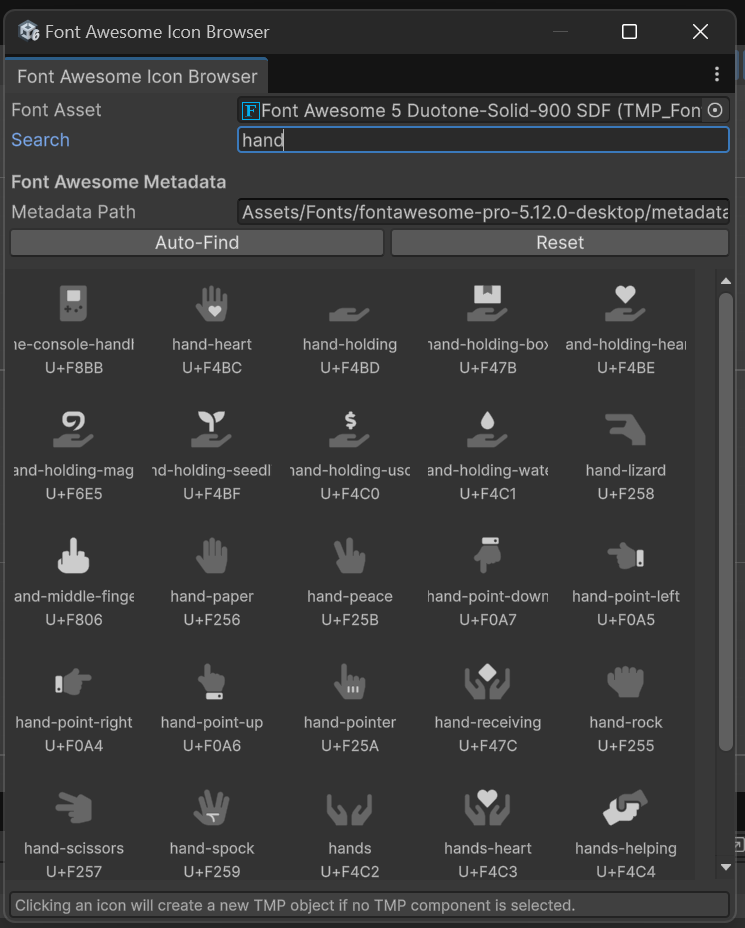
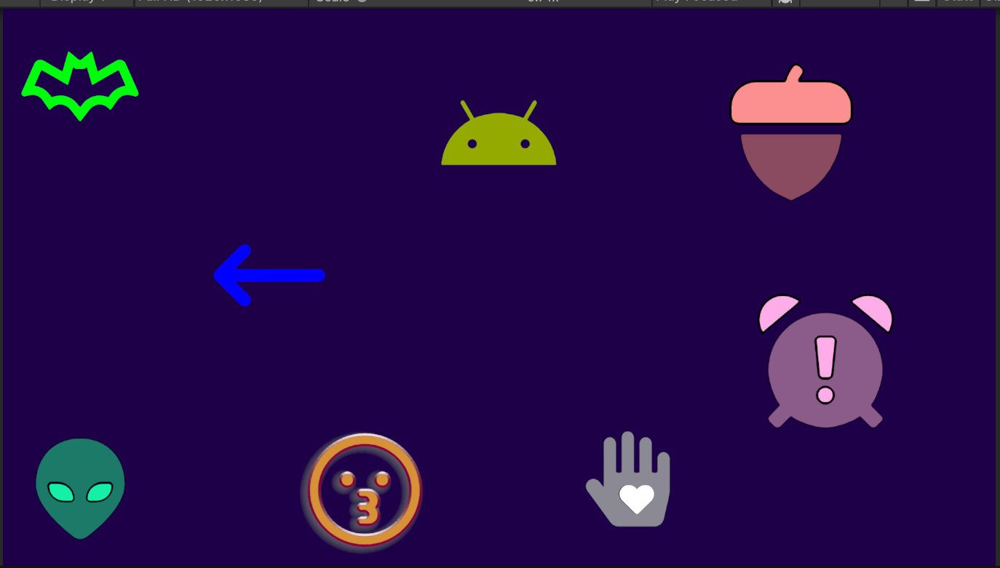

# Font Awesome Icon Browser UPM Package

This package adds a Unity editor workflow for browsing Font Awesome icons and inserting them into TextMeshPro objects.

The package is built around a searchable icon browser window and a small runtime helper for duotone icons.

 

## Installation

Add to projects using Package Manager git url:  
`https://github.com/williamrjackson/FontAwesomeUnity.git#v1.0.2`   
OR   
`https://github.com/williamrjackson/FontAwesomeUnity.git#v1.0`

## What it does

- Shows a searchable grid of Font Awesome icons from `icons.json`
- Lets you target an existing `TMP_Text` or create a new one
- Supports both `TextMeshProUGUI` and world-space `TextMeshPro`
- Can auto-install the pinned free Font Awesome desktop package
- Can auto-generate TMP SDF assets from the installed OTFs
- Supports duotone icons by creating a secondary TMP child layer
- Keeps duotone secondary layers synced through `FontAwesomeDuotoneSync`

---

 

## Opening the browser

Open:

`Tools > Font Awesome Icon Browser...`

## Basic workflow

1. Open the icon browser.
2. Assign a Font Awesome `TMP_FontAsset` if one is not already selected.
3. Search for an icon by name.
4. Click an icon in the grid.

The browser will:

- reuse the currently selected `TMP_Text` if one is selected
- otherwise create a new TMP object

New UI text objects are created with:

- `Auto Size` enabled
- `Font Size Max = 500`

## Metadata setup

The browser reads icon definitions from a Font Awesome `icons.json` file.

By default it can:

- auto-find a matching `icons.json` in the project
- remember the chosen path
- let you override the path manually

This is useful if you keep Font Awesome in a custom folder or want to point at a Pro package.

## Installing Font Awesome

If Font Awesome content is not found, the window can offer a pinned installer for:

`https://use.fontawesome.com/releases/v7.2.0/fontawesome-free-7.2.0-desktop.zip`

The installer:

- downloads the zip to a temp location
- extracts only the needed files into `Assets/Fonts/fontawesome-free-7.2.0-desktop`
- removes the temp zip afterward
- generates TMP SDF assets from the installed OTF files

Installed package content is intentionally trimmed to:

- `metadata/`
- `otfs/`
- `LICENSE.txt`

## Duotone icons

When the selected font asset is detected as a duotone font, the browser manages duotone behavior automatically behind the scenes.

For duotone icons it:

- previews the icon in the grid using overlaid glyphs
- creates or reuses a secondary TMP child named `FA Secondary Layer`
- adds `FontAwesomeDuotoneSync` to the primary object

### Duotone sync behavior

`FontAwesomeDuotoneSync` keeps the secondary layer aligned with the primary by syncing settings such as:

- font and material
- font size
- alignment
- spacing and wrapping
- UI rect sizing

Color behavior is intentionally slightly smarter:

- the secondary RGB follows the primary RGB by default
- the secondary alpha remains dimmer than the primary
- if you explicitly change the secondary RGB so it no longer matches, RGB syncing stops and your custom secondary color is preserved

## Notes and expectations

- Font Awesome support depends on the selected font asset and the metadata you point at.
- Free and Pro packages expose different icon/style sets.
- Duotone support works best when the selected metadata and font asset come from the same Font Awesome package/version.
- If a glyph is missing from a dynamic TMP font asset, the browser attempts to add it automatically.

## Package contents

| Path | Purpose |
|---|---|
| `Editor/FontAwesomeIconBrowserWindow.cs` | The editor browser window and install/setup workflow. |
| `Runtime/FontAwesomeDuotoneSync.cs` | Runtime/edit-mode helper that keeps duotone secondary layers synced to the primary text object. |
| `Documentation/` | Package docs and images. |

## Typical usage examples

### Single icon

- Select an existing `TextMeshProUGUI`
- Pick a Font Awesome font asset
- Click an icon

The selected TMP object is updated in place.

### New UI icon

- Select a GameObject under a `Canvas`
- Click an icon

The browser creates a new `TextMeshProUGUI` object with the icon already assigned.

### Duotone icon

- Pick a duotone Font Awesome TMP font asset
- Click a duotone-capable icon

The browser creates:

- a primary TMP object
- a secondary child layer
- a `FontAwesomeDuotoneSync` component on the primary
