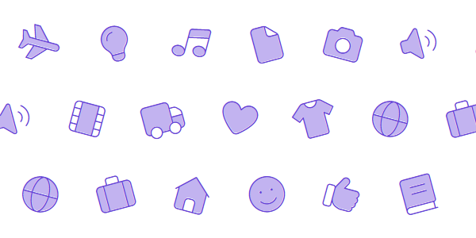
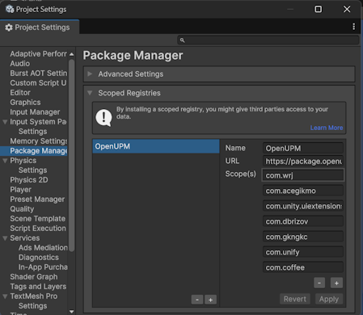
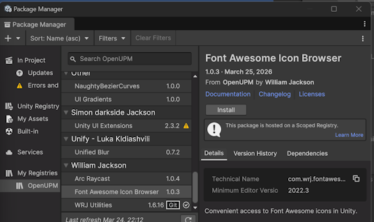

# Font Awesome Icon Browser

This package adds a Unity editor workflow for browsing Font Awesome icons and inserting them into TextMeshPro components.

 

The package is built around a searchable icon browser window and a small runtime helper for duotone icons.

 

## Installation

### Via Unity Package Manager (Git URL)

Go to: `Window → Package Manager → + → Add package from Git URL`

Use:

    https://github.com/williamrjackson/FontAwesomeUnity.git

Optionally pin to a specific version:

    https://github.com/williamrjackson/FontAwesomeUnity.git#v1.0.8

------------------------------------------------------------------------
### Via OpenUPM Scoped Registry

Go to: `Edit → Project Settings → Package Manager
`
- Add an OpenUPM package registry:  
   Name: `OpenUPM`   
   URL: `https://package.openupm.com`  
   Scope(s): `com.wrj`    
 
- Go to: `Window → Package Manager`
- Select `OpenUPM` under `My Registries`
- Select the `Font Awesome Icon Browser` package and click `Install`    
 

## What it does

- Provides a searchable grid of Font Awesome icons from `icons.json`
- Expands search results by enabled style, so the same icon can appear as separate `Solid`, `Regular`, `Light`, `Duotone`, or `Brands` entries
- Uses compact style toggle filters instead of requiring a single selected Font Awesome SDF asset
- Shows the associated SDF asset(s) for each enabled style in the browser
- Lets you target an existing `TMP_Text` or create a new one
- Supports both `TextMeshProUGUI` and world-space `TextMeshPro`
- Automatically download and install the latest free licensed Font Awesome desktop package
- Automatically generates TextMeshPro compatible SDF assets from the installed OTFs
- Supports duotone icons by creating a secondary sync'd TMP layer`

---

 

## Opening the browser

Open:

`Tools > Font Awesome Icon Browser...`

## Basic workflow

1. Open the icon browser.
2. Confirm or override the Font Awesome `icons.json` metadata path if needed.
3. Use the style filter buttons to enable the styles you want to browse.
4. Search for an icon by name.
5. Click the exact style result you want in the grid.

The browser will:

- reuse a pre-selected `TMP_Text` if one is selected
- otherwise create a new TMP object
- resolve the matching Font Awesome TMP SDF asset automatically based on the clicked style result

New UI TextMeshPro objects are created with:

- `Auto Size` enabled
- `Font Size Max = 500`

### Style filters

The browser reads the style combinations declared in `icons.json` and exposes them as compact toggle buttons.

- Icons remain visible if they match any enabled style
- A search like `cubes` can therefore show separate `Solid`, `Regular`, `Light`, and `Duotone` entries at the same time
- Each result tile represents a single icon-style combination
- The browser preview attempts to resolve the matching source font automatically for the selected style

## Metadata setup

The browser reads icon definitions from a Font Awesome `icons.json` file.

By default it can:

- auto-find a matching `icons.json` in the project
- Persist the path
- Allow you to override the path manually (useful if you have Font Awesome in a custom asset directory or want to point to a Pro package).

## Installing Font Awesome

If Font Awesome content is not found in the project Assets folder, this utility can automatically identify and download the latest Font Awesome Free release. If it fails to find the latest it will fall back to `https://use.fontawesome.com/releases/v7.2.0/fontawesome-free-7.2.0-desktop.zip`, which is the latest at time of release.

The installation:

- downloads the zip file to a temp location
- extracts only the required/useful files into `Assets/Fonts/fontawesome-free-{version}-desktop`
- cleans up temp files when done
- generates TextMeshPro SDF assets from the installed files

Generated Font Awesome SDF assets are configured with the project's default TMP font asset as a fallback so regular text can resolve through TMP fallback behavior when needed.

Installed package content is intentionally trimmed to:

- `metadata/`
- `otfs/`
- `LICENSE.txt`

## Duotone icons

When you click a duotone result, the browser manages a layered glyph behavior automatically behind the scenes.

For duotone icons it:

- previews the icon in the grid using overlaid glyphs
- creates or reuses a secondary TMP child named `FA Secondary Layer`
- adds `FontAwesomeDuotoneSync` to the primary object

### Duotone sync behavior

`FontAwesomeDuotoneSync` keeps the secondary layer aligned with the primary by syncing settings such as:

- font and material
- font size
- alignment
- spacing and wrapping
- UI rect sizing

Color sync behavior is slightly smarter:

- the secondary RGB follows the primary RGB by default
- the secondary alpha remains dimmer than the primary
- if you explicitly change the secondary RGB so it no longer matches, RGB syncing stops and your custom secondary color is preserved

## Notes and expectations

- Font Awesome support depends on the metadata you point at and the matching TMP SDF assets present in the project.
- Free and Pro packages expose different icon/style sets.
- Duotone support works best when the selected metadata and generated font assets come from the same Font Awesome package/version.
- Search results are style-specific. If multiple styles are enabled, the same icon name can appear more than once.
- Newly generated Font Awesome SDF assets are created from the package OTF files and then reused by the browser automatically.
- Existing SDF assets are not force-regenerated automatically; if you want to recreate them from scratch, delete the old SDF assets and let the browser generate them again.

## Package contents

| Path | Purpose |
|---|---|
| `Editor/FontAwesomeIconBrowserWindow.cs` | The editor browser window and install/setup workflow. |
| `Runtime/FontAwesomeDuotoneSync.cs` | Runtime/edit-mode helper that keeps duotone secondary layers synced to the primary text object. |

## Typical usage examples

### Single icon

- Select an existing `TextMeshProUGUI`
- Enable the style you want
- Click the matching icon result

The selected TMP object is updated in place.

### New UI icon

- Select a GameObject within a UI `Canvas` hierarchy
- Click an icon

The browser creates a new `TextMeshProUGUI` object with the icon already assigned.

### Duotone icon

- Enable `Duotone`
- Click a duotone-capable icon

The browser creates:

- a primary TMP object
- a secondary child layer
- a `FontAwesomeDuotoneSync` component on the primary
